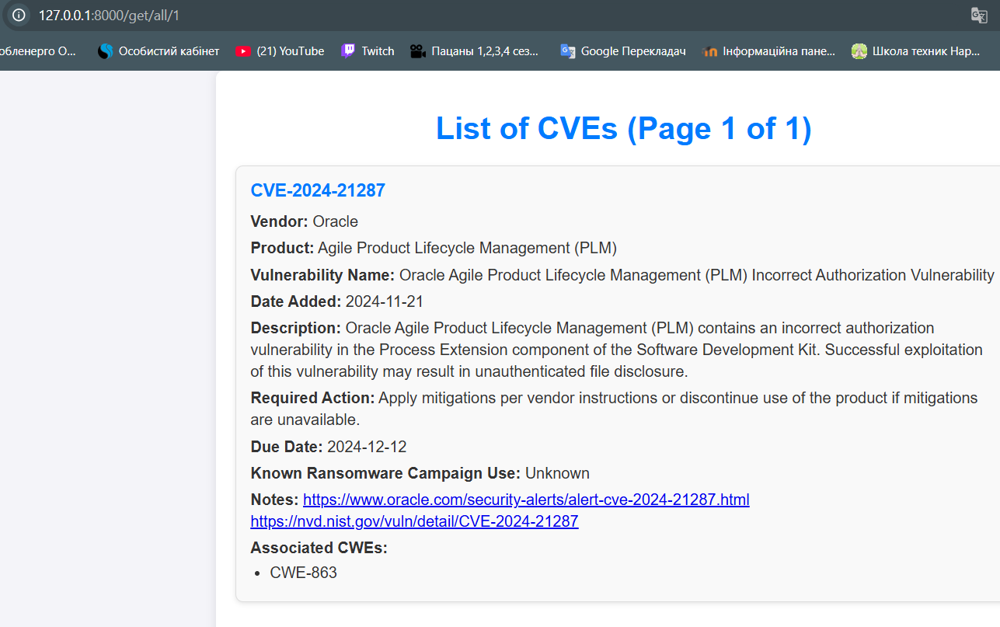

# FastAPI-Application-Part-1

Додаток написаний на fastapi з використання Jinja2Templates. Кожний endpoint обробляє окрема функція, яка бере інформаціз файлу. Виконує потрібні для неї перетворення, та передає потрібні дані до template. Відрендеревши template він повертається кінцевому користувачу, у вигляді html розмітки.

# Ендпоінти додатка

## Перелік доступних ендпоінтів:

1. **`/info`**
   - **Опис**: Повертає інформацію про додаток та автора.
   - **Вивід**: HTML-сторінка з базовою інформацією про розробника та функціональність додатка.

2. **`/get/all`**
   - **Опис**: Повертає список CVE, доданих за останні 30 днів (за останні днів 5 знайдено лише 1  cve)
   - **Обмеження**: Виводить максимум 40 CVE.
   - **Вивід**: HTML-сторінка зі списком уразливостей, відсортованих за датою додавання.

3. **`/get/new`**
   - **Опис**: Повертає 10 найновіших CVE.
   - **Вивід**: HTML-сторінка з інформацією про найновіші уразливості.

4. **`/get/known`**
   - **Опис**: Повертає CVE, де поле `knownRansomwareCampaignUse` має значення `Known`.
   - **Обмеження**: Виводить максимум 10 CVE.
   - **Вивід**: HTML-сторінка зі списком відповідних CVE.

5. **`/get?query="key"`**
   - **Опис**: Виконує пошук CVE, які містять ключове слово, передане через параметр `query`.
   - **Параметр**:
     - `query` (обов’язковий): Ключове слово для пошуку.
   - **Вивід**: HTML-сторінка зі списком CVE, що відповідають пошуковому запиту.

# Результат виконання

## Запуск додатка
- **Результат**: Додаток працює на локальному сервері за адресою [http://127.0.0.1:8000](http://127.0.0.1:8000).

### Скріншот:

## Ендпоінт `/info`

### Скріншот:

## Ендпоінт `/get/all/1`

### Скріншот:

## Ендпоінт `/get/new`

### Скріншот:

## Ендпоінт `/get/known`

### Скріншот:

## Ендпоінт `/get?qeury`

### Скріншот:

